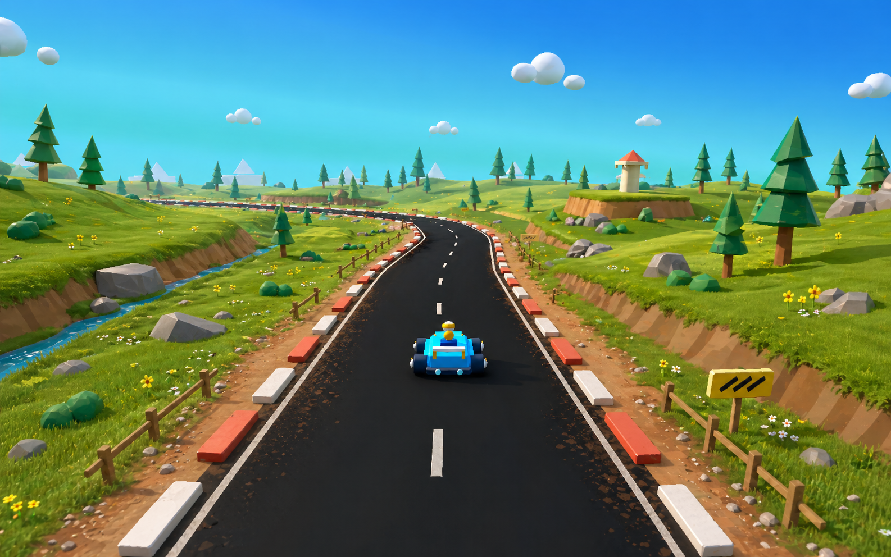

# BlockKart Terrain Visual Roadmap

This roadmap is the long-form plan for turning BlockKart terrain from a playable prototype surface into a polished stylized kart-racing environment. The goal is not a quick incremental polish pass. The goal is to approach the terrain quality and composition of the concept target over multiple production passes.

## North Star

BlockKart terrain should read as a designed outdoor racing world:

- the road is embedded in the land instead of floating over a flat grass plane
- road shoulders show dirt, gravel, worn grass, and tire-scrubbed edges
- terrain has broad readable landforms: hills, cut banks, shallow valleys, drainage swales, and raised overlooks
- material zones are clear from the gameplay camera: lush grass, worn grass, dirt, gravel, rock, flowers, and cliff faces
- props follow the terrain composition instead of being scattered evenly
- lighting, fog, sky, and horizon color create depth without washing out the toy-like palette

The scene should feel like a premium low-poly kart-racing track: bright, tactile, playful, and readable at speed.

## Current Assessment

voplay is good enough to start serious terrain production. It already supports:

- heightmap terrain with physics sampling
- four-layer terrain splat materials
- per-layer albedo, normal, metallic-roughness, UV scale, and normal scale
- fog, color grading, hemisphere ambient, directional lights, shadows, and render debug views
- retained primitive layers, instancing, static chunks, and renderer-side culling
- basic decals and particle emitters

The current BlockKart terrain pipeline is not yet organized like a production terrain system. Most of the work ahead is content pipeline, generation structure, art direction, and verification. Engine work should be driven by visual blockers discovered while building the vertical slice.

## Strategy Correction: Target-State Slice First

The first exploratory M1 pass proved that the terrain pipeline can be changed, but it did not prove that the image is moving toward the concept. The visible result is still dominated by a flat fluorescent grass plane, with only a modest road-edge band. Continuing with broad, evenly distributed procedural tweaks would not be enough.

The production strategy is therefore stricter:

- build one hero road segment to target quality before improving the whole map
- judge progress from the fixed gameplay screenshots, not from generator complexity
- accept ugly unfinished areas outside the hero segment if the hero segment becomes more concept-like
- prioritize silhouette, road embedding, material separation, and composition over coverage
- make the target screenshot noticeably different within each terrain milestone

The hero segment should contain the visual ingredients from the concept image: road cut into terrain, raised banks, dirt/gravel shoulders, visible slope faces, clustered trees, rocks, fences or signs, and stronger lighting/color separation. This is the proof that BlockKart can reach the target style. Whole-map production should come after that proof.

## Strategy Correction: Agent-Facing Loop, Not Human Editor

The terrain editor plan is abandoned. BlockKart will not build a human-facing terrain UI for this phase. The production path is an agent-facing optimization loop:

- edit structured terrain recipe data and named generator terms
- regenerate the real primitive-track heightmap and splat assets
- capture fixed views from the normal BlockKart runner
- compare those real screenshots against the concept target
- repeat until the screenshot moves toward the target composition

The active loop contract lives in `docs/terrain-agent-loop.md`. The editing
method lives in `docs/terrain-agent-editing-paradigm.md`. Contour maps,
heightmap previews, and review boards are useful only as diagnostics. They do
not replace real runner screenshots.

The current terrain work should follow a human-editor-inspired process:
large-form blockout first, road spline cut second, valley/ridge composition
third, cleanup fourth, and surface detail last. Randomly adding mounds and
ditches is now explicitly deprecated.

## Guiding Principles

- Build against fixed reference screenshots, not subjective memory.
- Improve big forms before adding small details.
- Keep gameplay readability above decorative density.
- Do not add random props to compensate for weak landforms.
- Use voplay's normal renderer, material, terrain, primitive, and asset paths. No screenshot-only tricks.
- Treat every voplay upgrade as a response to a visible BlockKart problem.
- Preserve the toy-like low-poly style: clean silhouettes, matte materials, simple forms, strong color separation.

## Non-Goals

- Do not rewrite voplay before the first terrain vertical slice proves it is needed.
- Do not chase photorealistic terrain.
- Do not solve AI, progression, menus, or race rule polish in this roadmap.
- Do not turn the world into dense visual noise.
- Do not accept a terrain pass only because the asset generator became more complex.

## Milestone Overview

### M0: Terrain Direction Lock

Purpose: define what "good terrain" means before building more code.

Deliverables:

- this roadmap
- `docs/terrain-capture-views.md`
- concept target stored under `docs/images/`
- current baseline screenshots from fixed gameplay cameras
- terrain art notes: palette, landform language, material zones, and forbidden looks
- a list of fixed capture cameras: start straight, first bend, road shoulder, elevated view, hero landmark

Exit criteria:

- every future terrain pass can be judged against the same shots
- the team can say why a pass is closer or farther from the concept

### M1: Road-Embedded Terrain Vertical Slice

Purpose: make one gameplay-facing road segment prove that BlockKart can approach the concept target.

Scope:

- refactor `tools/generate_primitive_terrain.mjs` into named terrain layers
- choose a single hero segment around the start straight and first bend
- generate an intentionally composed track corridor, shoulders, cut banks, drainage swales, ridges, and fields for that segment
- make road shoulder width and material response vary by curve and slope
- allow stronger local elevation contrast near the road, even if distant terrain remains rough
- add enough temporary composition anchors around the hero segment to test the concept read: slope faces, rocks, trees, fence/sign rhythm, and a visible landmark silhouette
- tune heightmap without changing kart control or track logic

Deliverables:

- updated primitive terrain generator
- regenerated `heightmap_large.png` and `terrain_splat_large.png`
- first fixed-camera before/after screenshot set

Exit criteria:

- the fixed first-bend or elevated start screenshot reads as a different scene, not merely a tuned version of the old flat field
- road edges no longer read as a black strip pasted onto grass
- near-road terrain has readable shoulder, bank, slope face, and grass transition
- broad landforms are visible before final prop polish is added
- at least one screenshot has concept-like depth: foreground road, embedded shoulder, midground hill/cut, and background separation
- `./d.py check /Users/wuhao/code/github/BlockKart` passes

### M2: Terrain Material Identity

Purpose: make ground materials look intentional, not procedural noise.

Scope:

- redesign terrain splat semantics
- author or generate stronger terrain textures for grass, worn grass/meadow, dirt/gravel, and rock/cliff
- tune normal map scale per material
- reduce global tint dependence
- add debug screenshots for albedo, normal, roughness, and lit terrain

Deliverables:

- terrain material reference sheet
- improved terrain textures under `assets/maps/primitive_track/`
- updated splat generation rules
- material debug proof screenshots

Exit criteria:

- grass, dirt, and rock are identifiable in lit view and debug view
- grass is bright but not fluorescent
- dirt shoulder does not become a brown carpet
- rock appears on slopes and banks where it supports landform readability

### M3: Road Edge and Surface Integration

Purpose: upgrade the road/terrain contact area to concept quality.

Scope:

- improve road mesh edges and curb placement
- add road-edge dirt scuffs, gravel flecks, worn grass, and occasional skid marks
- evaluate whether decals are enough or if road-edge texture baking is needed
- align fences, signs, and curb blocks with terrain contours

Deliverables:

- road shoulder kit
- decal or mesh-based road markings
- updated track visual generator
- start straight and bend screenshots

Exit criteria:

- asphalt, curb, dirt shoulder, and grass edge form a coherent band
- road markings and edge wear survive gameplay camera distance
- the start straight reads as designed, not generated by unrelated systems

### M4: Landmarks and Terrain Composition

Purpose: make the environment memorable from the driving line.

Scope:

- define terrain-driven landmark zones
- place large tree clusters, rock clusters, overlooks, small architecture, and distant hills by composition
- add low valleys, water/drainage lines, and raised platforms where they support silhouettes
- keep props grouped and directional rather than evenly scattered

Deliverables:

- landmark placement map
- prop cluster rules
- at least one hero vista from the driving camera

Exit criteria:

- a screenshot is recognizable by landform and landmark layout
- distant scenery creates depth without distracting from the track
- props reinforce terrain shape instead of hiding weak terrain

### M5: Vegetation and Prop Kit Production

Purpose: make repeated world details consistent and performant.

Scope:

- build or refine reusable trees, bushes, rocks, flowers, fences, signs, barriers, and small structures
- enable primitive static chunking in BlockKart when prop density requires it
- establish prop scale, color, roughness, and silhouette rules
- add cluster variation without creating noise

Deliverables:

- reusable terrain prop kit
- placement presets for banks, fields, road edge, water edge, and overlooks
- primitive stats targets in the HUD

Exit criteria:

- repeated props look cohesive
- prop density can increase without destroying frame time
- foreground, midground, and background have different detail levels

### M6: Lighting, Atmosphere, and Color Finish

Purpose: make the terrain pass feel polished through the normal renderer.

Scope:

- tune skybox, fog color/range, sun direction, fill, ambient ground, shadow strength, exposure, contrast, and saturation
- verify terrain in lit, albedo, normal, roughness, metallic, direct, ambient, and shadow views
- decide whether additional voplay color or shadow work is needed

Deliverables:

- lighting profile notes
- final screenshot set for milestone comparison
- updated exposure check references if needed

Exit criteria:

- terrain has readable sun side, shadow side, and distance falloff
- shadows ground props without crushing terrain color
- screenshots stay bright and saturated without clipping into neon

### M7: Production Hardening

Purpose: make the terrain pipeline sustainable for months of iteration.

Scope:

- make terrain generation deterministic and documented
- add snapshot capture scripts for fixed cameras
- add dependency validation for generated terrain assets
- add performance gates for primitive counts, draw calls, and screenshot exposure
- identify voplay upgrades that are now justified by visible blockers

Deliverables:

- one-command terrain generation
- one-command screenshot capture
- performance and visual QA checklist
- backlog of engine upgrades with concrete visual motivation

Exit criteria:

- future terrain work can be reviewed from generated artifacts
- regressions are visible quickly
- voplay changes are prioritized by BlockKart needs

## Likely voplay Work, But Not First

The current voplay base is enough for M1-M3. These engine upgrades may become worthwhile later:

- terrain chunking or tiled terrain for larger maps and higher local detail
- more than four terrain layers, or multiple splat passes
- triplanar or slope-aware cliff material blending
- stronger projected decals for road edge dirt, skid marks, arrows, and boost pads
- terrain-aware prop placement helpers
- baked primitive layer assets and track-distance chunking
- improved vegetation rendering if primitive meshes become too heavy

Do not start these until a BlockKart screenshot clearly shows the limitation.

## First Concrete Workstream

The next real work should be M0 plus the smallest useful part of M1:

1. Capture a clean baseline screenshot set from fixed cameras.
2. Document the current terrain problems against the concept target.
3. Refactor the terrain generator into named functions:
   - `trackCorridorHeight`
   - `shoulderProfile`
   - `cutBankHeight`
   - `fieldHeight`
   - `ridgeHeight`
   - `drainageHeight`
   - `terrainSplatWeights`
4. Generate one vertical-slice terrain pass for the start straight and first bend.
5. Compare screenshots before deciding the next engine or art task.

## Current Local Note

There is an exploratory terrain parameter pass in the working tree from the first investigation. Treat it as disposable research unless it is deliberately folded into M1. It should not be considered the roadmap baseline.

## Implementation Status

Started:

- `docs/terrain-capture-views.md` defines the terrain screenshot review set.
- F6 cycles BlockKart through four fixed terrain capture cameras:
  - start straight
  - first bend
  - road edge
  - overlook
- `tools/generate_primitive_terrain.mjs` now separates terrain generation into named layers instead of one combined height/splat formula:
  - `trackCorridorHeight`
  - `shoulderProfile`
  - `fieldHeight`
  - `ridgeHeight`
  - `landmarkBasinHeight`
  - `drainageHeight`
  - `lowPolyFacetHeight`
  - `terrainSplatWeights`
- Current M1 screenshot artifacts:
  - `docs/images/terrain-m1-start.png`
  - `docs/images/terrain-m1-start-elevated.png`
  - `docs/images/terrain-m1-first-bend.png`
  - `docs/images/terrain-m1-road-edge.png`
  - `docs/images/terrain-m1-overlook.png`
- Sharper hero-slice experiment:
  - `docs/images/terrain-m1-hero-v2-start-elevated.png`
  - `docs/images/terrain-m1-hero-v2-first-bend.png`
  - `docs/images/terrain-m1-hero-v2-road-edge.png`
  - `docs/images/terrain-m1-hero-v2-overlook.png`

Current read:

- The road shoulder band is now visible from elevated views.
- The dirt shoulder is still too texture-grid-like and needs a stronger authored material pass.
- The terrain palette is still too fluorescent, even after tint adjustment; this likely belongs in M2/M6 through texture and lighting work, not just splat weights.
- The sharper hero-slice experiment creates a visible difference, but it currently reads too much like blocky temporary platforms. It proves the target-state-slice method is more honest than gradual whole-map tweaking, but the next pass must replace the slab look with terrain-like slope faces and authored material identity.
- Broad landforms exist but are still too procedural and too dependent on noisy splat texture. M1 should keep pushing larger banks, swales, and local elevation changes around the road corridor, while M2 must start earlier than planned if the ground surface keeps reading as a grid-textured neon carpet.
